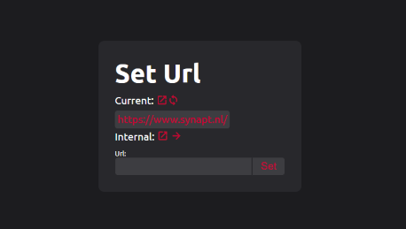
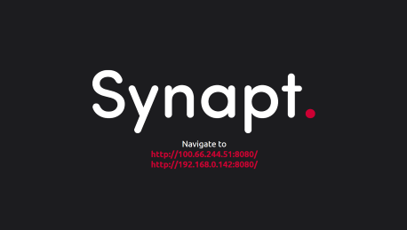
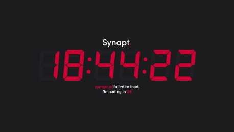

# WebKontrol

[](https://github.com/IJIJI/WebKontrol/blob/main/LICENSE) [](https://github.com/IJIJI/WebKontrol/releases) 

An intuitive web kiosk with a web based admin panel.

 

I originally developed this for the livestreaming industry. This allows me to display a clock, but also use something like [stagetimer.io](https://stagetimer.io/). This can also be implemented in an information display, or even a touchscreen kiosk.

> ⚠️ **This is not yet fully developed, and the code is not perfect. I will continue developing this. In its current state I have tested the platform to be stable.**

# Getting started

I am planning to sell pre-configured boxes on my store. If you are interested, [contact me](mailto:shop@synapt.nl).

## Install

WebKontrol is Python based, which means it can run on a lot of operating systems. It is tested on **windows 11** and **Raspberry Pi OS (Desktop).** The first part of the install is interchangable between both, but make sure you have python, pip and git installed.

#### Dependencies

```shell
pip install selenium
pip install flask
pip install threading
pip install netifaces
sudo apt-get install chromium-browser
```

#### Code

```shell
git clone https://github.com/IJIJI/WebKontrol.git --branch V0.4
cd WebKontrol/src
python WebKontrol.py
```

#### Autostart (Raspberry Pi OS)

```shell
sudo nano /etc/xdg/lxsession/LXDE-pi/autostart
```

Add the python script to the end of the startup file. Your location may differ.

```shell
@python /home/Webkontrol/src/WebKontrol.py
```

Make sure to safe the file.

#### Auto hide the cursor (Raspberry Pi OS)

```shell
sudo apt-get install unclutter
sudo nano /etc/xdg/lxsession/LXDE-pi/autostart
```

Add the unclutter script to the end of the startup file. You can change the timeout, it is set to 2.

```shell
@unclutter -idle 2
```

Make sure to safe the file.

## Use

Once you have started the script, you should see the splash screen appearing. It lists the IP addresses on which the web interface is available. If you are on a touchscreen you can press the IP you wish to access, else you have to type it in your browsers search bar. It should look something like this:



Once you navigate to one of the IP addresses you should see the web interface. Make sure you type in the IP followed by port **8080**


In the admin interface there are three buttons and one input.

- **View:** Opens the current url in a new tab.
- **Reload:** Reloads the browser on the WebKontrol instance. It also returns to the set URL. If you have navigated on the instance and then relaod it will return to the requested URL.
- **Internal Clock:** When pressed, the internal clock button fills the input with the link to the internal clock.
- **Input:** Here you can enter the URL you wish to display on the WebKontrol instance.

#### No connection

If the page that is requested fails, WebKontrol will retry every 30 seconds. While it waits it will display a page with the current time and a countdown.


