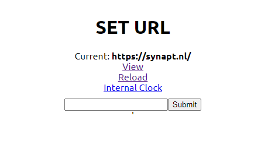

# WebKontrol

[](https://github.com/IJIJI/WebKontrol/blob/main/LICENSE)[](https://github.com/IJIJI/WebKontrol/releases)

An intuitive web kiosk with a web based admin panel.

 

I originally developed this for the livestreaming industry. This allows me to display a clock, but also use something like [stagetimer.io](https://stagetimer.io/). This can also be implemented in an information display, or even a touchscreen kiosk.

# Getting started

I am planning to sell pre-configured boxes on my store. If you are interested, [contact me](mailto:shop@synapt.nl).

### Self install

WebKontrol is Python based, which means it can run on a lot of operating systems. It is tested on **windows 11** and **Raspberry Pi OS (Desktop).** The first part of the install is interchangable between both, but make sure you have python, pip and git installed.

##### Dependencies

```bash
pip install selenium
pip install flask
pip install threading
pip install netifaces
sudo apt-get install chromium-browser
```

##### Code

```bash
git clone https://github.com/IJIJI/WebKontrol.git --branch V0.3
cd WebKontrol/src
python WebKontrol.py
```
