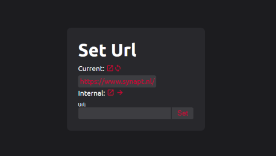
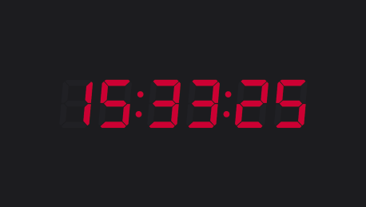
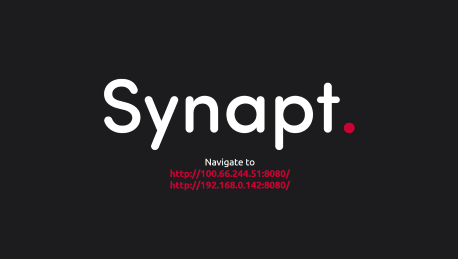
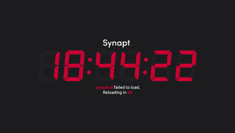

# WebKontrol

[](https://github.com/IJIJI/WebKontrol/blob/main/LICENSE) [](https://github.com/IJIJI/WebKontrol/releases) 

WebKontrol turns any machine into a remote controlled display. It can drive multiple displays and show websites and views built in the blockbuilder. WebKontrol features a webinterface and remote control through platforms like Bitfocus Companion.

 

> [!WARNING]
> **We are currently in the midst of a full rewrite to version 3, but its in the early stages.** It works, but we cannot gaurantee complete stability yet. Use **[v2](#v2-the-stable-release)** in live production scenarios for now, as it has been thoroughly tested.

## Backstory

I originally built WebKontrol for the live-streaming industry. It allows me to display a clock or use something like [stagetimer.io](https://stagetimer.io/). It turned out to work for information displays and touch kiosks just as well, offering more remote control than most existing solutions I have tried. 

The first two versions only supported a single screen displaying an url. In the latest version this has been expanded to offer an expansive view builder, plugin support and a usefull web interface. We are currently implementing plugin support, which would enable data sources from different platforms and conditional rendering.

I am planning to sell pre-configured boxes with SDI outputs in my store. If you are interested, [contact me](mailto:shop@synapt.nl).

## Terminology

**Puppets**: Each display that is launched. A puppet handles crashes and failed page loads. All information is displayed in the web interface.

**Views**: A view is a page assignable to a *puppet*. Currently there are two types: A website view, which is just an url and a block view, which can be built out. The block view can also display websites.

# Getting Started

WebKontrol is Node-based and runs wherever Node runs. It is tested on **Windows 11** and **Raspberry Pi OS Full** on the Raspberry Pi 4. We are currently working on pre-build Raspberry Pi binaries, a Docker image and a Windows installer.

Installed systems can be updated from the admin UI, under settings.

## Prerequisites

- **Node 22 or newer**, with yarn available through corepack: `corepack enable`
- **tar** (ships with Windows 10+ and every Linux)
- On Linux, the libraries Chromium needs (Raspberry Pi OS Full has them; on a minimal Debian, `sudo apt install chromium` pulls them in)

The installer checks these and tells you what is missing; it never installs anything itself.

## Install
Pick an install directory. In the following example `/opt/webkontrol` is used/

```shell
curl -fsSL https://raw.githubusercontent.com/ijiji/WebKontrol/main/install.mjs -o install.mjs
node install.mjs /opt/webkontrol
```

This installs the latest stable release. Releases marked **pre-release** on GitHub are never installed by default: to install one deliberately, pass its tag:

```shell
node install.mjs /opt/webkontrol --version v3.0.0
```

> [!NOTE]
> While v3 is in early access, v3.0.0 is published as a pre-release, so the `--version` form above is the one to use.

The installer writes a commented starter `config/config.yaml`; edit it to add your displays (or prepare the file beforehand, the installer keeps an existing one). A minimal config with one display:

```yaml
puppets:
  - id: hall-1
    name:
      long: Hallway display
      short: HALL1

web:
  port: 80
```

You never need git on a device. A git checkout is the developer setup (see [Develop](#develop)) and cannot be updated from the UI.

<!-- TODO: ## Config Guide -->

## Run

```shell
cd /opt/webkontrol
node supervisor.js
```

The admin serves on the configured port (default 80). Open `http://<the machine's address>/` from any browser on the network.

To start on boot, the installer prints a ready-to-paste systemd unit at the end of the install.


## Raspberry Pi OS

The generic install works on Raspberry Pi OS with a few extra steps.

### Port 80

Allow Node to bind port 80 without root:

```bash
sudo setcap 'cap_net_bind_service=+ep' `which node`
```

### Chromium

Puppeteer downloads its own Chromium during install, which is not built for the Pi's ARM CPU. Point each puppet at the system browser instead (find it with `which chromium-browser` or `which chromium`):

```yaml
puppets:
  - id: hall-1
    name:
      long: Hallway display
      short: HALL1
    chromiumExecutablePath: /usr/bin/chromium-browser
```

<!-- TODO: verify on a Pi that a plain `yarn workspaces focus --production` with the shared puppeteer cache does not fail on the ARM Chromium download; if it does, document PUPPETEER_SKIP_DOWNLOAD for the install. -->


### Start on boot

The browsers need the desktop, so the supervisor must start inside the desktop session, not as a bare system service. Add it to the LXDE autostart:

```bash
sudo nano /etc/xdg/lxsession/LXDE-pi/autostart
```

```
@sh -c 'cd /opt/webkontrol && node supervisor.js'
```

> [!NOTE]
> This autostart file is read by the X11 desktop. Check which one runs with `echo $XDG_SESSION_TYPE`; to switch to X11 run `sudo raspi-config`, option 6, then A6 "Wayland toggle".

<!-- TODO: the systemd unit the installer prints has no DISPLAY; either document a user unit with Environment=DISPLAY=:0 here or make the installer print that variant on Linux. -->

### Auto-hide the cursor

```shell
sudo apt-get install unclutter -y
```

Add `@unclutter -idle 2` to the same autostart file (the number is the idle seconds before the cursor hides).

### Disable screen blanking

`sudo raspi-config`, option 2 Display, then D2 Screen Blanking: disable it.
<!-- 

## Use

Once you have started the script, you should see the splash screen appearing. It lists the IP addresses on which the web interface is available. It should look something like this:



Once you navigate to one of the IP addresses you should see the web interface.


In the admin interface, there are four buttons and one input.

- **View:** Opens the current URL in a new tab.
- **Reload:** Reloads the browser on the WebKontrol instance. It also returns to the set URL. If you the puppet and then reload, it will return to the originally requested URL.
- **View Internal Clock:** Opens the internal clock in a new tab.
- **Internal Clock:** When pressed, this fills the input with the link to the internal clock.
- **Input:** Here you can enter the URL you wish to display on the WebKontrol instance.

#### No connection

If the page that is requested fails, WebKontrol will retry every 30 seconds. While it waits it will display a page with the current time and a countdown.

 -->


# v2: Stable

v2 is the previous generation: one browser, one URL, a small web panel with a clock. It has run in production for a long time and is the recommended choice when you need something proven today.

- Download: the source archive of the [v2.0.0 release](https://github.com/IJIJI/WebKontrol/releases/tag/v2.0.0).
- Install and Raspberry Pi guide: the [README at v2.0.0](https://github.com/IJIJI/WebKontrol/blob/v2.0.0/README.md).

v2 and v3 do not share a config or database; moving a display from v2 to v3 is a fresh install of v3.

<!-- 
# Develop

The repository is the developer setup; end users install with the installer above and never need it.

```shell
git clone https://github.com/IJIJI/WebKontrol.git
cd WebKontrol/app
corepack enable
yarn install
cp config/config.yaml config/config.local.yaml   # your own displays; gitignored, replaces config.yaml when present
yarn dev
```

- `yarn dev` runs the app directly with the admin in Vite's dev mode; a checkout is always "plain mode": the update manager is off and updates are `git pull`.
- `yarn check` runs the assert-based check files, `yarn typecheck` both TypeScript projects, `yarn lint` ESLint.
- `yarn e2e:update` runs the update system end to end against a local fake GitHub (real installer, real supervisor, real tarballs; about 15 minutes). `--hold` keeps the managed system running for clicking through the Updates UI by hand.
- `yarn build` produces `dist/`; `yarn serve` runs it under the supervisor, the way an installed system runs.

Releases are made on GitHub (tag `vX.Y.Z` matching `app/package.json`, notes, the pre-release flag); the workflow builds the update tarball and attaches it, and installed systems see it on their next check. -->
