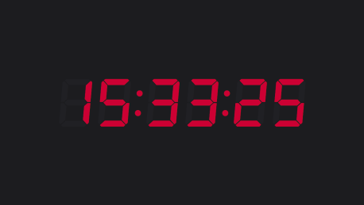

# WebKontrol

[](https://github.com/IJIJI/WebKontrol/blob/main/LICENSE) [](https://github.com/IJIJI/WebKontrol/releases) 

An intuitive web kiosk with a web-based admin panel.

 

I originally developed this for the live streaming industry. It allows me to display a clock or use something like [stagetimer.io](https://stagetimer.io/). This can also be implemented in an information display or even a touchscreen kiosk.

> ⚠️ **This is not yet fully developed, and the code is imperfect. I will continue developing this. In its current state, I have tested the platform to be stable.**

# Getting started

I am planning to sell pre-configured boxes with SDI outputs in my store. If you are interested, [contact me](mailto:shop@synapt.nl).

# Install

WebKontrol is Node-based, which means it can run on a lot of operating systems. It is tested on **windows 11** and **Raspberry Pi OS (Desktop).** 

## Debian:

### Update OS

```shell
sudo apt-get update &&
sudo apt-get upgrade -y
```

### Dependencies

```shell
sudo apt install git -y &&
sudo apt install nodejs -y &&
sudo apt install npm -y &&
sudo apt install chromium-browser -y &&
sudo npm install --global tsx -y &&
sudo npm install --global yarn -y
```

### Code

Make a directory:

```shell
sudo mkdir /opt/WebKontrol
```
Clone and install the code:

```shell
sudo git clone https://github.com/IJIJI/WebKontrol.git /opt/WebKontrol --branch V0.5 &&
cd /opt/WebKontrol/src &&
sudo yarn
```

To start WebKontrol you can run this:
```shell
sudo yarn start
```

You can now access WebKontrol from your browser! When connected to a display, it will list its IP Address(es).

## Raspberry Pi OS (Desktop)
The above config still holds for Raspberry Pi OS, but requires a few more steps.
First off, to launch the script you may have to do so with a custom chromium location as Puppeteer does not always recognize that automatically. Run the script by adding the location. You can find that location by running: `which chromium-browser`

```bash
yarn start --chromium=/usr/bin/chromium/
```

### Give the right permissions
Open access to port 80.
```bash
sudo setcap 'cap_net_bind_service=+ep' `which node`
```
Give access to the config file.
```bash
sudo chmod a+rwx /opt/WebKontrol/src/config.json
```
The following steps are made and tested on Raspberry Pi OS. If you have a different operating system these steps may also differ.

### Autostart
```bash
sudo nano /etc/xdg/lxsession/LXDE-pi/autostart
```

Add the script to the end of the file. Your location may differ.

```yaml
#/etc/xdg/lxsession/LXDE-pi/autostart
@yarn --cwd /opt/WebKontrol/src start
```

Make sure to save the file.

### Auto-hide the cursor (Debian)

```shell
sudo apt-get install unclutter -y
```

Add the unclutter script to the end of the startup file. You can change the timeout. Here, it is set to 2:
```bash
sudo nano /etc/xdg/lxsession/LXDE-pi/autostart
```

```yaml
#/etc/xdg/lxsession/LXDE-pi/autostart
@unclutter -idle 2
```

Make sure to save the file.

## Use

Once you have started the script, you should see the splash screen appearing. It lists the IP addresses on which the web interface is available. If you are on a touchscreen you can press the IP you wish to access, else you have to type it in your browser's search bar. It should look something like this:


Once you navigate to one of the IP addresses you should see the web interface.


In the admin interface, there are three buttons and one input.

- **View:** Opens the current URL in a new tab.
- **Reload:** Reloads the browser on the WebKontrol instance. It also returns to the set URL. If you have navigated on the puppet and then reload, it will return to the requested URL.
- **View Internal Clock:** Opens the internal clock in a new tab.
- **Internal Clock:** When pressed, this fills the input with the link to the internal clock.
- **Input:** Here you can enter the URL you wish to display on the WebKontrol instance.

#### No connection

If the page that is requested fails, WebKontrol will retry every 30 seconds. While it waits it will display a page with the current time and a countdown.


